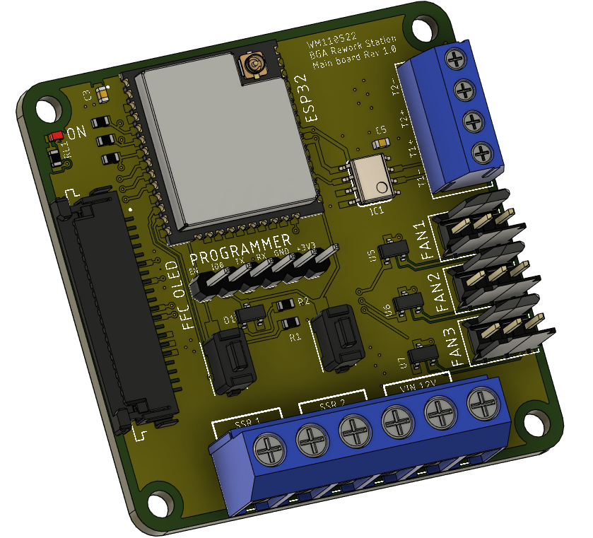
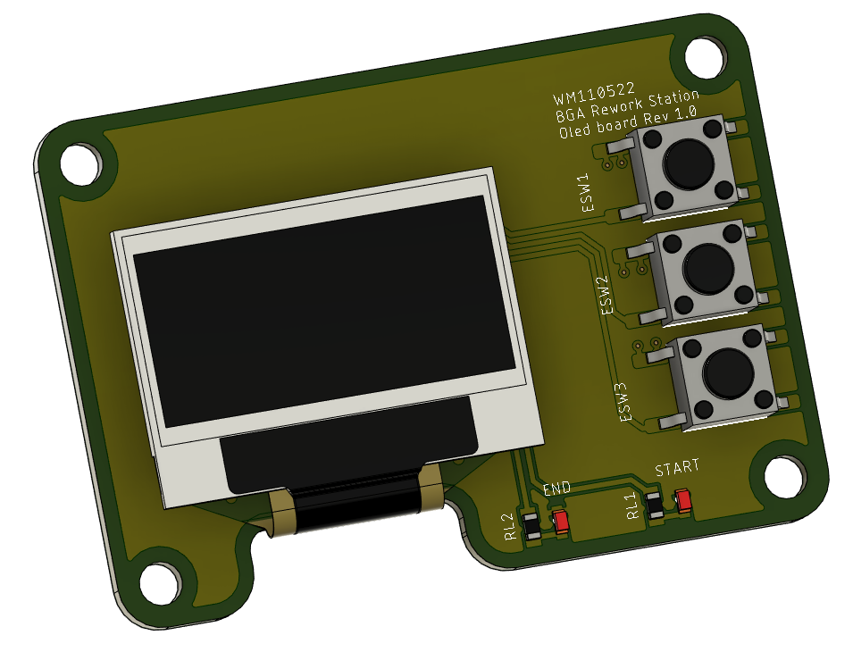

# BGA_rework_station

Projekt stacji lutowniczej BGA.
W projekcie wykorzystany został układ ESP32-WROOM-32U ze względu na niską cenę i możliwość połączenia poprzez Bluetooth oraz WiFi z innym urządzeniem, dzieki czemu będzie możliwe sterowanie stacją za pomocą specjalnie stworzonej aplikacji do tego projektu nastawami temperatury, czasu nagrzewania, wygrzewania i chłodzenia oraz podglądu w czasie rzeczywistym na aktualny postęp w formie wykresu nad procesem lutowania. 
Płyta główna umożliwia wykorzystanie następujących układów zewnętrznych:

- dwie termopary typu K,
- dwa przekaźniki SSR sterujące oddzielnie górną oraz dolną grzałką,
- trzy wentylatory, z czego dwa chłodzące lutowaną płytę główną oraz jeden przeznaczony do chłodzenia przekaźników SSR.

Dodatkowo w skład systemu wchodzi wyświetlacz oled, trzy przyciski oraz dwie diody led na oddzielnej płytce, która docelowo znajdzie się na froncie stacji. Dzięki temu rozwiązaniu za pomocą aplikacji i połączenia bezprzewodowego będzie możliwe stworzenie dokładnych profili pracy, wgranie ich do pamięci ESP32 i za pomocą przedniego panelu włączenie wybranego w dowolnej chwili bez konieczności użycia aplikacji na komputerze. 

Projekt cały czas w rozwoju.
